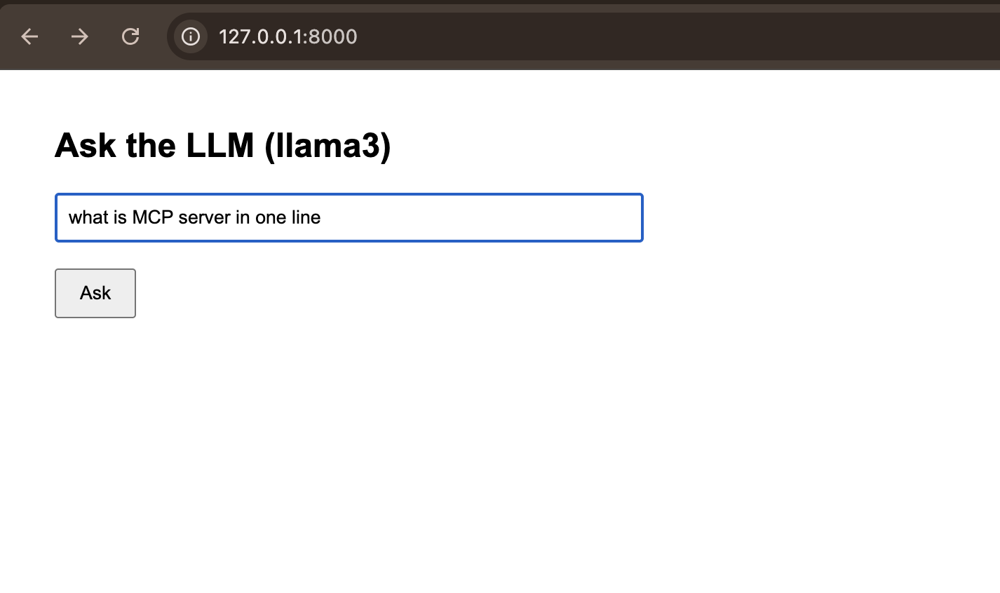
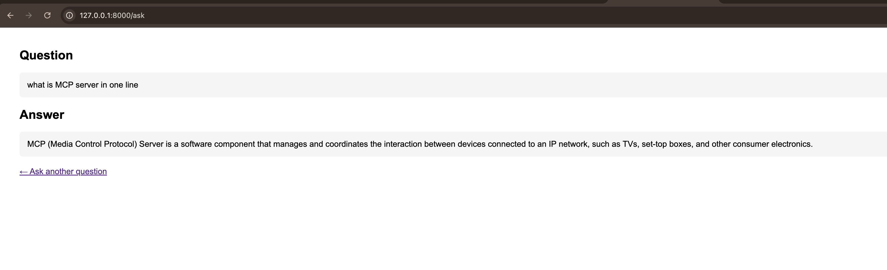

# Ollama Web App

A lightweight local AI Q&A web app built with FastAPI and Jinja templates. It provides a simple browser interface where users submit a prompt, sends it to a local Ollama model, and displays the generated response page.

## Screenshots

### Ask Page



### Response Page



## Project Structure

- `app.py`: FastAPI app and routes
- `templates/index.html`: Home page with question form
- `templates/answer.html`: Answer page rendered after form submit

## Prerequisites

- Python 3.11+
- Ollama installed
- A local Ollama model available (default in code: `llama3`)

## Install Ollama

Use the official Ollama installer for your platform:

### macOS

- Download the macOS app from https://ollama.com/download/Ollama.dmg
- Ollama requires macOS 14 Sonoma or later
- Open the `.dmg`, drag Ollama to `Applications`, then launch it once

### Windows

- Download the Windows installer from https://ollama.com/download/OllamaSetup.exe
- Ollama requires Windows 10 or later
- Run the installer, then open Ollama after installation completes

### Linux

Run the official install script:

```bash
curl -fsSL https://ollama.com/install.sh | sh
```

For manual Linux installation details, see https://docs.ollama.com/linux

### Verify the Install

After installation, start Ollama if it is not already running and pull the default model used by this app:

```bash
ollama pull llama3
```

## Setup

```bash
python3 -m venv .venv
source .venv/bin/activate
pip install fastapi uvicorn httpx jinja2 python-multipart
```

## Run the Project

Run these in separate terminals.

1. Start Ollama server:

```bash
ollama serve
```

2. Start FastAPI app:

```bash
uvicorn app:app --reload
```

3. Open in browser:

```text
http://127.0.0.1:8000
```

## How to Test in Browser

1. Open `/` to load `index.html`.
2. Enter a question and submit.
3. The app sends a request to `http://localhost:11434/api/chat`.
4. The response is rendered on `/ask` using `answer.html`.

## Notes

- If Ollama is not running, `/ask` requests will fail.
- The current model is set in `app.py` as `MODEL = "llama3"`.
